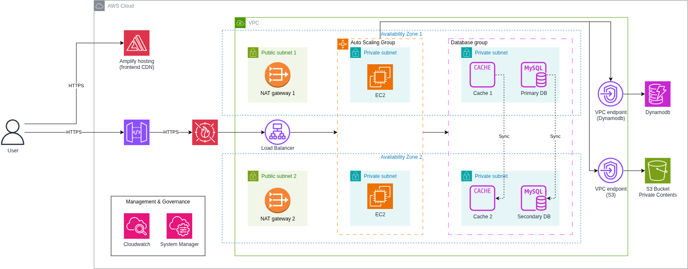

#### Introduction

In this workshop, a **full-stack Learning Management System (LMS)** will be deployed on AWS — entirely with **Terraform**. Instead of clicking through the AWS Console, every resource is defined as code: networking, compute, databases, caching, storage, security, and monitoring. At the end, a single `terraform destroy` tears down all resources cleanly.

This is a hands-on, step-by-step journey from an empty AWS account to a production-grade, scalable web application — no prior Terraform experience required.

A **3-tier architecture** spanning two Availability Zones:

- **Tier 1 (Public & Edge):** AWS Amplify Hosting serves the React/Vite frontend via global CDN. AWS API Gateway HTTP API acts as a managed HTTPS proxy to the Application Load Balancer. Regional AWS WAF v2 protects the ALB.
- **Tier 2 (Private App):** EC2 instances run Node.js with PM2 inside an Auto Scaling Group in private subnets. No public IPs. Outbound internet traffic routes through NAT Gateways. Inbound traffic comes **only** from the ALB.
- **Tier 3 (Private DB):** RDS MySQL (Multi-AZ), ElastiCache Redis, and DynamoDB tables sit in isolated subnets. Only the application tier can reach them.

AWS services leveraged in this architecture:

| Category | Service | What It Does for the App |
|----------|---------|--------------------------|
| **Frontend Hosting** | AWS Amplify Hosting | Hosts React/Vite SPA with global CDN and automated SSL |
| **API Gateway** | AWS API Gateway HTTP API | Managed HTTPS proxy endpoint forwarding traffic to ALB |
| **Edge Security** | Regional AWS WAF v2 | Web ACL protecting ALB from OWASP Top 10, bad inputs, and rate-limiting |
| **Compute** | EC2 Auto Scaling | Runs Node.js backend; replaces failed instances automatically |
| **Load Balancing** | Application Load Balancer | Distributes traffic across EC2 instances in private subnets; health checks |
| **Relational Database** | RDS MySQL (Multi-AZ) | Stores users, courses, enrollments, grades |
| **In-Memory Cache** | ElastiCache Redis | Sessions, rate limiting, fast lookups |
| **NoSQL Database** | DynamoDB | Course content, forum posts, quizzes, schedules |
| **Object Storage** | Amazon S3 (3 buckets) | Private storage for uploads, artifacts, and frontend backups with VPC Endpoints |
| **Management & Governance** | CloudWatch + SSM | Alarms (ALB errors, CPU, scaling); Session Manager (no SSH needed) |

#### Why Terraform?

| Reason | What It Means |
|--------|-----------------------|
| **Declarative** | Specify *what* is needed; Terraform calculates *how* to provision it |
| **Single workflow** | `init → plan → apply → destroy` — four commands for everything |
| **State tracking** | Terraform tracks state and detects configuration drift |
| **Clean teardown** | `terraform destroy` removes every resource in minutes — no leftover resources |
| **Transferable skills** | The patterns learned (variables, outputs, modules) apply to any cloud project |

#### What is the Outcome

By the end of this workshop, participants will be able to:

- Create an IAM user and generate AWS access keys
- Install and configure Terraform + AWS CLI
- Design a multi-tier VPC with public, private, and database subnets across two AZs
- Route traffic with Internet Gateways, NAT Gateways, and VPC Gateway Endpoints
- Configure Security Groups following least-privilege principles
- Assign IAM roles so EC2 instances access S3, DynamoDB, RDS, and ElastiCache without hardcoded credentials
- Deploy Regional AWS WAF v2 Web ACL with OWASP rules and rate limiting
- Configure AWS Amplify Hosting for React/Vite Single Page Application
- Deploy AWS API Gateway HTTP API as a managed HTTPS proxy to ALB
- Deploy RDS MySQL Multi-AZ for high availability
- Deploy ElastiCache Redis with encryption at-rest and in-transit
- Provision DynamoDB tables with Global Secondary Indexes for flexible queries
- Create an Auto Scaling Group with Launch Template and `user_data` bootstrapping
- Front application servers with an Application Load Balancer and health checks
- Monitor the stack with CloudWatch metric alarms and SNS notifications
- Connect to private EC2 instances securely via SSM Session Manager
- Configure GitHub Actions workflows for automated CI/CD deployment
- Destroy every resource cleanly with a single command

#### Architecture Principles

{}
Throughout the workshop, the architecture follows these core principles:

- **Least privilege:** Every security group rule and IAM policy grants *only* required permissions.
- **High availability:** Two Availability Zones for ALB, EC2, RDS, and Redis. If one AZ fails, the app keeps running.
- **Zero public exposure for compute:** EC2, RDS, and Redis reside in private subnets. Only ALB and Amplify face the internet.
- **Encryption everywhere:** RDS, Redis, S3, and EBS volumes are encrypted. IMDSv2 is enforced on EC2.
- **No SSH:** SSM Session Manager provides secure shell access without opening port 22.
{}

#### Estimated Time

| Phase | Activity | Time |
|-------|----------|------|
| Setup | Install Terraform, AWS CLI, Git; configure IAM credentials; `terraform init` | 15 min |
| Networking & Security | VPC, 6 subnets across 2 AZs, IGW, NAT GWs, route tables, VPC Gateway Endpoints, Security Groups, IAM Roles, Regional WAF v2 | 20 min |
| Data Layer | S3 buckets, RDS MySQL Multi-AZ, ElastiCache Redis, DynamoDB tables, AWS Amplify Hosting | 20 min |
| Compute & ALB | Launch template, Auto Scaling Group, Application Load Balancer, API Gateway HTTP API | 20 min |
| Monitoring | SNS topic, CloudWatch metric alarms (ALB 5xx, RDS CPU >80%, ASG below min) | 10 min |
| Deploy & Verify | `terraform apply`, SSM Session Manager verification, curl health check endpoints | 15 min |
| CI/CD | GitHub Actions secrets, automated frontend deployment to Amplify and backend rolling instance refresh | 15 min |
| Clean Up | `terraform destroy`, verify all resources removed | 10 min |
| **Total** | | **~2 hours** |

#### Content

1. [Workshop Overview](5.1-Workshop-overview/) ← Current Section
2. [Prerequisites](5.2-Prerequiste/)
3. [Networking & Security](5.3-networking-security/)
4. [Data Layer](5.4-data-layer/)
5. [Compute & Load Balancing](5.5-compute-alb/)
6. [Monitoring](5.6-monitoring/)
7. [Deploy & Verify](5.7-deploy-verify/)
8. [CI/CD](5.8-cicd/)
9. [Clean Up](5.9-cleanup/)