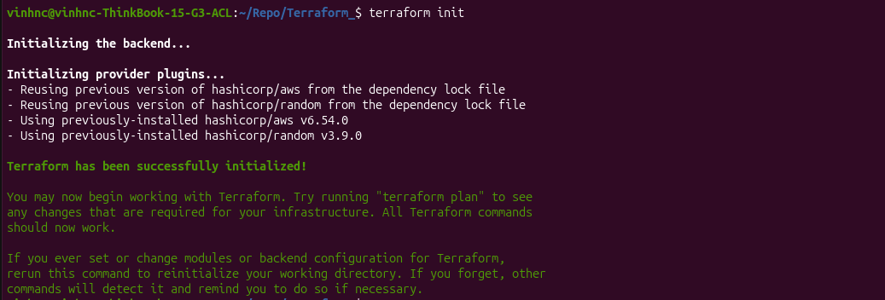
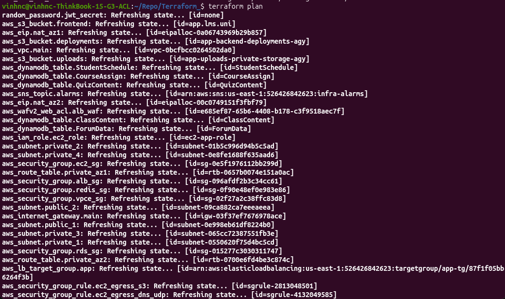
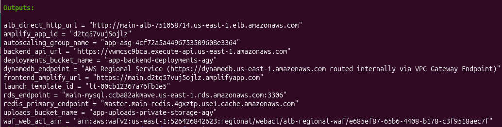
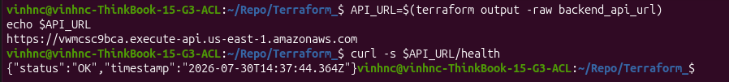
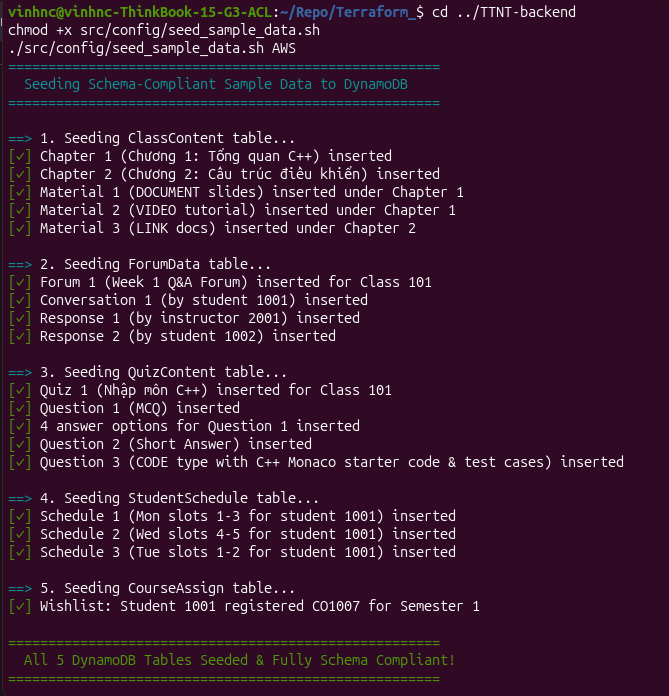

Now that all Terraform files (`provider.tf`, `vpc.tf`, `security_groups.tf`, `iam.tf`, `s3.tf`, `waf.tf`, `amplify.tf`, `apigateway.tf`, `rds.tf`, `redis.tf`, `dynamodb.tf`, `ec2.tf`, `alb.tf`, `cloudwatch.tf`, `outputs.tf`) are configured, we will provision the entire infrastructure and verify that all services operate properly.

---

#### Step 1: Initialize Terraform & Review the Plan

1. Navigate to the Terraform repository folder:
   ```bash
   cd Terraform_
   ```

2. Initialize provider plugins and modules:
   ```bash
   terraform init
   ```


3. Generate and review the execution plan:
   ```bash
   terraform plan
   ```


{}
`terraform plan` compares your HCL code against the current cloud state and displays all resources to be created (50+ AWS resources).
{}

---

#### Step 2: Provision Infrastructure (`terraform apply`)

Run the apply command and type `yes` when prompted:

```bash
terraform apply
```

Upon successful completion, Terraform outputs all key endpoint URLs and resource identifiers:



{}
**Save These Outputs!**
Copy and save the output values printed at the end of `terraform apply` (especially `backend_api_url`, `frontend_amplify_url`, and `amplify_app_id`). You will need these endpoints for verification and setting up your GitHub Actions CI/CD secrets in later steps.
{}

##### Expected Provisioning Timeline:
- **0–2 min**: VPC, subnets, IGW, route tables, security groups, IAM roles, WAF v2 Web ACL, API Gateway HTTP API
- **2–5 min**: NAT Gateways, VPC Endpoints, S3 Buckets, DynamoDB Tables, AWS Amplify App
- **5–15 min**: RDS MySQL Multi-AZ DB Instance & ElastiCache Redis Replication Group
- **15–20 min**: EC2 Launch Template & Auto Scaling Group instances booting

Total execution time is approximately **15–20 minutes**.


---

#### Step 3: Verify Backend API Health

Retrieve the managed HTTPS API Gateway endpoint from Terraform outputs and run a health check:

```bash
# Get the backend API URL output
API_URL=$(terraform output -raw backend_api_url)
echo $API_URL

# Check API health
curl -s $API_URL/health
```

Expected output:
```json
{"status":"ok"}
```



---

#### Step 4: Seed Sample Application Data For Testing (Optional)

Populate initial course data, users, and forum content into RDS MySQL and DynamoDB:

```bash
cd ../TTNT-backend
chmod +x src/config/seed_sample_data.sh
./src/config/seed_sample_data.sh AWS

```

