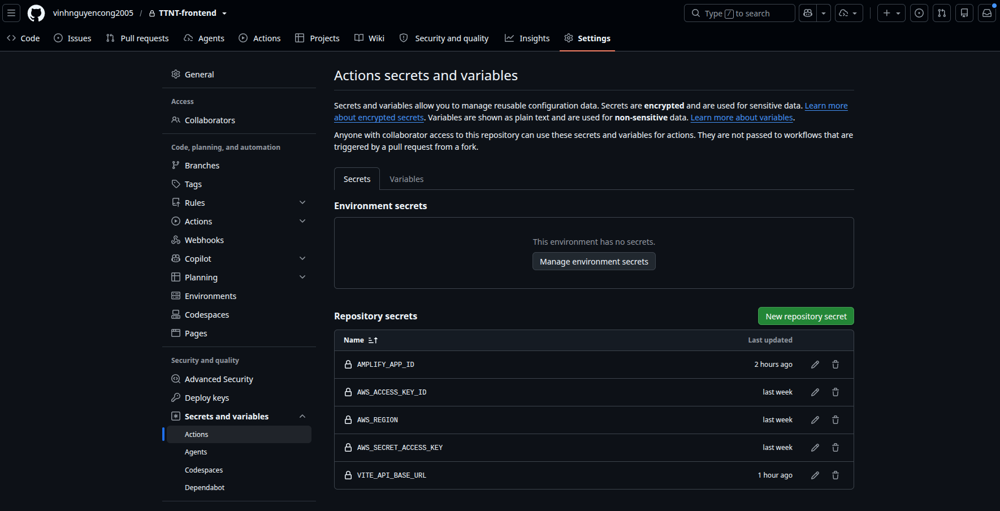
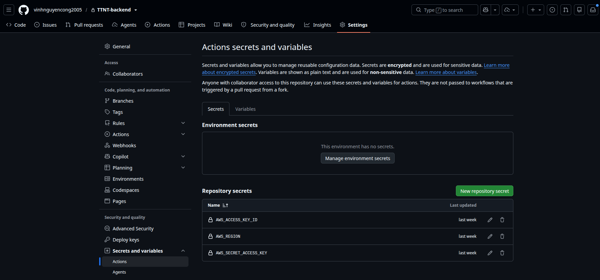
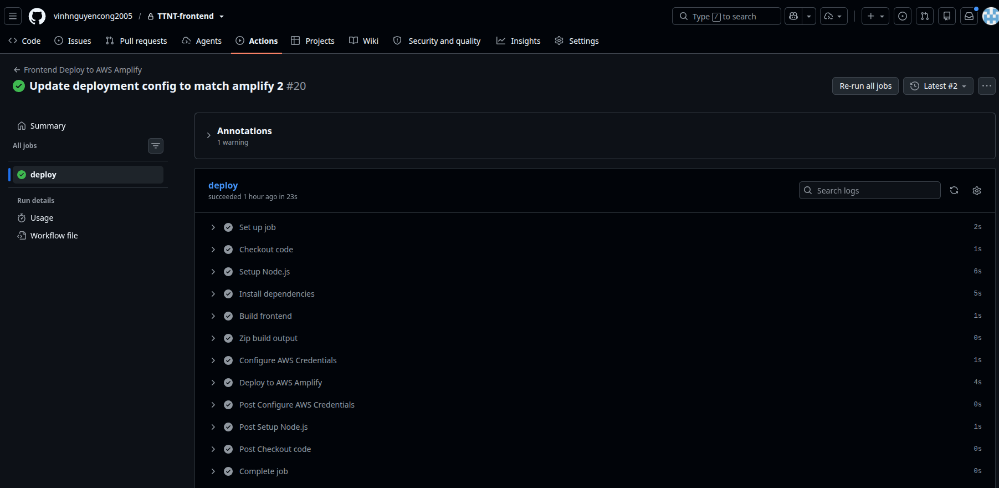
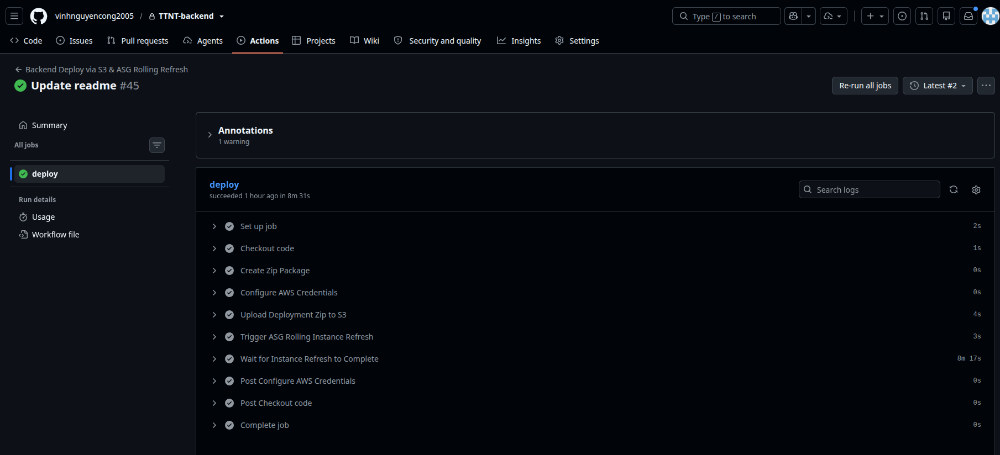
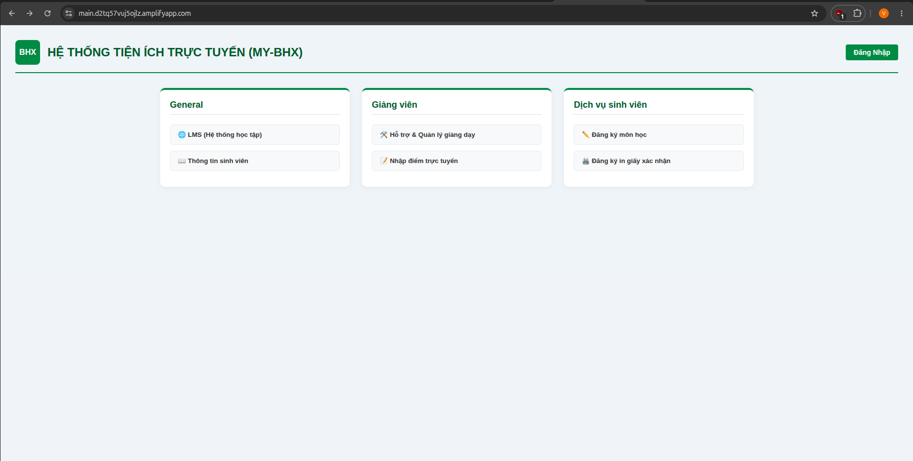
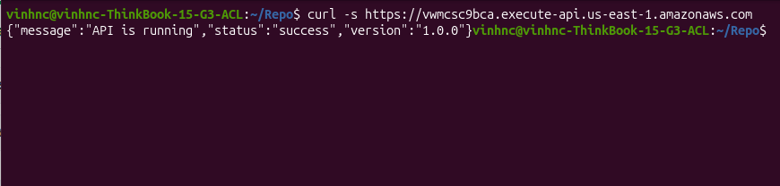

Automating deployments ensures that code updates push seamlessly to production. In this section, we configure GitHub Repository Secrets and learn how to trigger automated CI/CD workflows for both the **Frontend (AWS Amplify)** and **Backend (EC2 Auto Scaling Group)**.

---

#### Step 1: Configure GitHub Repository Secrets

Before running workflows, add your AWS credentials and Terraform output endpoints to GitHub:

1. Open your GitHub repositories (`TTNT-frontend` and `TTNT-backend`).
2. Go to **Settings** $\rightarrow$ **Secrets and variables** $\rightarrow$ **Actions** $\rightarrow$ **New repository secret**.
3. Add the following secrets:

| Secret Name | Description / Value Source |
| :--- | :--- |
| `AWS_ACCESS_KEY_ID` | IAM User Access Key ID |
| `AWS_SECRET_ACCESS_KEY` | IAM User Secret Access Key |
| `AWS_REGION` | AWS Region (`us-east-1`) |
| `AMPLIFY_APP_ID` | Value from `terraform output amplify_app_id` |
| `VITE_API_BASE_URL` | Value from `terraform output backend_api_url` (API Gateway HTTPS) |




{}
Ensure `VITE_API_BASE_URL` points to your **API Gateway HTTPS URL** (`https://<api-id>.execute-api.us-east-1.amazonaws.com`) to prevent browser Mixed Content errors.
{}

---

#### Step 2: How the Deployment Workflows Function

- **Frontend Workflow (`frontend-deploy.yml`)**:
  Compiles the React/Vite web application, bundles the output into a deployment archive, uploads it to AWS Amplify using a presigned upload URL, and triggers an immediate global CDN release.

- **Backend Workflow (`backend-deploy.yml`)**:
  Packages the Node.js API server code, uploads the deployment zip to the private S3 deployment bucket, and triggers an automatic **EC2 Auto Scaling Group Rolling Instance Refresh** to update app servers without downtime.

---

#### Step 3: Triggering Deployments

Whenever you push new code to the `main` branch, GitHub Actions automatically starts the deployment workflow:

```bash
# 1. Stage your changes
git add .

# 2. Commit your code
git commit -m "Update application code"

# 3. Push to GitHub
git push origin main
```



---

#### Step 4: Monitor Execution & Verify Deployment

1. Click on the active workflow run in the **Actions** tab to view step-by-step execution logs in real time.
2. Once the job turns green (✅ **Success**), test your application:
   - Open your frontend app: `https://main.<app-id>.amplifyapp.com`
   - Test API health: `curl -s https://<api-id>.execute-api.us-east-1.amazonaws.com/health`



